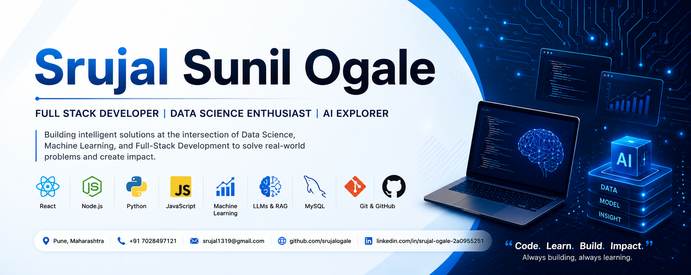

<h1 align="center">Hi 👋, I'm Srujal Sunil Ogale</h1>
<h3 align="center">
Computer Engineering | Full Stack Developer | AI & Data Science Enthusiast
</h3>

  

---

## 🚀 About Me

- 🎓 Computer Engineering student from Pune, India
- 🤖 Passionate about AI, Machine Learning, Agentic AI, and RAG systems
- 🌐 Building scalable full-stack web applications using React and Node.js
- 📊 Interested in Data Science, Analytics, and AI-powered products
- 📚 Currently learning advanced LLM application development and system design

---

## 🛠️ Tech Stack

### Languages

  

### Frontend

  

### Backend

  

### AI / Data Science

  

  
  
  

### Tools & Platforms

  

---

## 📌 Featured Projects

### 🔹 AI Financial Analysis Portfolio
AI-powered financial analysis platform using React, Node.js, OpenAI GPT, Gemini, and Claude.

**Tech Used:** React, Node.js, REST APIs, LLMs, RAG

🔗 Repository:  
https://github.com/srujalogale/AI-Financial-Analysis-Portfolio

---

### 🔹 Smart Traffic Management System
IEEE conference project focused on AI-based traffic optimization and emergency vehicle prioritization.

**Tech Used:** Python, Machine Learning, IoT, Data Analysis

🔗 Repository:  
https://github.com/srujalogale/Smart-Traffics-Management-system

---

### 🔹 Customer Churn Prediction
Machine learning project predicting customer churn using classification algorithms and data analytics.

**Tech Used:** Python, Pandas, NumPy, Scikit-learn

🔗 Repository:  
https://github.com/srujalogale/Customer-Churn-Prediction

---

## 💼 Experience

### Data Science Intern — Aparaitech Software
- Built data preprocessing and feature engineering pipelines
- Automated reporting workflows reducing manual effort
- Created dashboards using Power BI and Tableau
- Integrated APIs and validated structured datasets

---

## 📈 GitHub Stats

  

## 🌐 Connect With Me

  
  
  

---

## ⚡ Fun Fact

I enjoy building AI-powered applications that solve real-world engineering and business problems.
